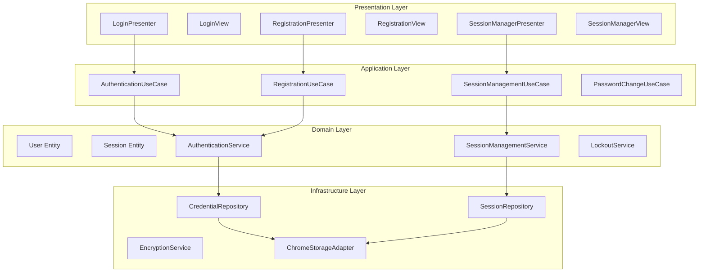

# Design Document: User Authentication System

## Overview

This design document outlines the implementation of a comprehensive user authentication system for the auto-fill tool Chrome extension. The system builds upon the existing Clean Architecture foundation and extends the current master password functionality to provide a complete authentication solution with session management, security controls, and seamless user experience.

The authentication system will integrate with the existing domain layer (UnlockStatus, MasterPasswordRequirements, PasswordStrength) and presentation layer (UnlockPresenter, MasterPasswordSetupPresenter) while adding new components for enhanced security and user management.

## Architecture

The authentication system follows the established Clean Architecture pattern with clear separation of concerns:



## Components and Interfaces

### Domain Layer Components

#### User Entity
```typescript
class User {
  constructor(
    public readonly id: UserId,
    public readonly passwordHash: string,
    public readonly salt: string,
    public readonly createdAt: Date,
    public readonly lastLoginAt: Date | null,
    public readonly failedAttempts: number,
    public readonly lockedUntil: Date | null
  ) {}
  
  // Methods for user management
  isLockedOut(): boolean
  canAttemptLogin(): boolean
  incrementFailedAttempts(): User
  resetFailedAttempts(): User
  updateLastLogin(): User
}
```

#### Session Entity
```typescript
class Session {
  constructor(
    public readonly id: SessionId,
    public readonly userId: UserId,
    public readonly createdAt: Date,
    public readonly expiresAt: Date,
    public readonly isActive: boolean,
    public readonly encryptionKey: string
  ) {}
  
  // Methods for session management
  isExpired(): boolean
  extend(duration: number): Session
  invalidate(): Session
  getRemainingTime(): number
}
```

#### Authentication Service
```typescript
interface AuthenticationService {
  registerUser(password: string, confirmation: string): Promise<Result<User, AuthenticationError>>
  authenticateUser(password: string): Promise<Result<Session, AuthenticationError>>
  changePassword(currentPassword: string, newPassword: string): Promise<Result<void, AuthenticationError>>
  validateSession(sessionId: SessionId): Promise<Result<Session, AuthenticationError>>
}
```

#### Session Management Service
```typescript
interface SessionManagementService {
  createSession(userId: UserId): Promise<Result<Session, SessionError>>
  extendSession(sessionId: SessionId): Promise<Result<Session, SessionError>>
  invalidateSession(sessionId: SessionId): Promise<Result<void, SessionError>>
  cleanupExpiredSessions(): Promise<Result<number, SessionError>>
}
```

#### Lockout Service
```typescript
interface LockoutService {
  checkLockoutStatus(userId: UserId): Promise<Result<LockoutStatus, LockoutError>>
  recordFailedAttempt(userId: UserId): Promise<Result<LockoutStatus, LockoutError>>
  resetFailedAttempts(userId: UserId): Promise<Result<void, LockoutError>>
}
```

### Application Layer Components

#### Authentication Use Case
```typescript
class AuthenticationUseCase {
  constructor(
    private authService: AuthenticationService,
    private sessionService: SessionManagementService,
    private lockoutService: LockoutService,
    private encryptionService: EncryptionService
  ) {}
  
  async login(request: LoginRequest): Promise<Result<LoginResponse, AuthenticationError>>
  async logout(sessionId: SessionId): Promise<Result<void, AuthenticationError>>
  async checkAuthenticationStatus(): Promise<Result<AuthenticationStatus, AuthenticationError>>
}
```

#### Registration Use Case
```typescript
class RegistrationUseCase {
  constructor(
    private authService: AuthenticationService,
    private encryptionService: EncryptionService
  ) {}
  
  async registerUser(request: RegistrationRequest): Promise<Result<RegistrationResponse, RegistrationError>>
  async isRegistrationRequired(): Promise<Result<boolean, RegistrationError>>
}
```

#### Session Management Use Case
```typescript
class SessionManagementUseCase {
  constructor(
    private sessionService: SessionManagementService,
    private encryptionService: EncryptionService
  ) {}
  
  async extendCurrentSession(): Promise<Result<Session, SessionError>>
  async getCurrentSession(): Promise<Result<Session, SessionError>>
  async invalidateCurrentSession(): Promise<Result<void, SessionError>>
}
```

### Infrastructure Layer Components

#### Credential Repository
```typescript
interface CredentialRepository {
  saveUser(user: User): Promise<Result<void, RepositoryError>>
  findUser(): Promise<Result<User | null, RepositoryError>>
  updateUser(user: User): Promise<Result<void, RepositoryError>>
  deleteUser(): Promise<Result<void, RepositoryError>>
}
```

#### Session Repository
```typescript
interface SessionRepository {
  saveSession(session: Session): Promise<Result<void, RepositoryError>>
  findSession(sessionId: SessionId): Promise<Result<Session | null, RepositoryError>>
  findActiveSession(): Promise<Result<Session | null, RepositoryError>>
  updateSession(session: Session): Promise<Result<void, RepositoryError>>
  deleteSession(sessionId: SessionId): Promise<Result<void, RepositoryError>>
  deleteExpiredSessions(): Promise<Result<number, RepositoryError>>
}
```

#### Encryption Service
```typescript
interface EncryptionService {
  hashPassword(password: string, salt: string): Promise<Result<string, EncryptionError>>
  generateSalt(): Result<string, EncryptionError>
  verifyPassword(password: string, hash: string, salt: string): Promise<Result<boolean, EncryptionError>>
  deriveEncryptionKey(password: string, salt: string): Promise<Result<string, EncryptionError>>
  encryptData(data: string, key: string): Result<string, EncryptionError>
  decryptData(encryptedData: string, key: string): Result<string, EncryptionError>
}
```

### Presentation Layer Components

#### Login Presenter
```typescript
class LoginPresenter {
  constructor(
    private view: LoginView,
    private authUseCase: AuthenticationUseCase,
    private logger: Logger
  ) {}
  
  init(): void
  handleLoginAttempt(): Promise<void>
  handlePasswordInput(): void
  checkAuthenticationStatus(): Promise<void>
}
```

#### Registration Presenter
```typescript
class RegistrationPresenter {
  constructor(
    private view: RegistrationView,
    private registrationUseCase: RegistrationUseCase,
    private logger: Logger
  ) {}
  
  init(): void
  handleRegistration(): Promise<void>
  handlePasswordInput(): void
  handlePasswordConfirmInput(): void
}
```

## Data Models

### Authentication Request/Response Models

```typescript
interface LoginRequest {
  password: string
}

interface LoginResponse {
  sessionId: SessionId
  expiresAt: Date
  user: {
    id: UserId
    lastLoginAt: Date
  }
}

interface RegistrationRequest {
  password: string
  confirmation: string
}

interface RegistrationResponse {
  userId: UserId
  sessionId: SessionId
  expiresAt: Date
}

interface AuthenticationStatus {
  isAuthenticated: boolean
  sessionId?: SessionId
  expiresAt?: Date
  isLockedOut: boolean
  lockoutExpiresAt?: Date
  remainingAttempts?: number
}
```

### Value Objects

```typescript
class UserId {
  constructor(private readonly value: string) {}
  toString(): string { return this.value }
  equals(other: UserId): boolean { return this.value === other.value }
}

class SessionId {
  constructor(private readonly value: string) {}
  toString(): string { return this.value }
  equals(other: SessionId): boolean { return this.value === other.value }
}

class LockoutStatus {
  constructor(
    public readonly isLockedOut: boolean,
    public readonly expiresAt: Date | null,
    public readonly remainingAttempts: number
  ) {}
  
  static notLockedOut(remainingAttempts: number): LockoutStatus
  static lockedOut(expiresAt: Date): LockoutStatus
  getRemainingTime(): number
}
```

Now I need to use the prework tool to analyze the acceptance criteria before writing the correctness properties.

## Correctness Properties

*A property is a characteristic or behavior that should hold true across all valid executions of a system-essentially, a formal statement about what the system should do. Properties serve as the bridge between human-readable specifications and machine-verifiable correctness guarantees.*

Based on the requirements analysis, the following correctness properties must be validated through property-based testing:

### Property 1: Password Validation Consistency
*For any* password string, the authentication system should validate it consistently against security requirements (minimum 8 characters, uppercase, lowercase, numbers, special characters) regardless of context (registration or password change).
**Validates: Requirements 1.2, 5.2**

### Property 2: Password Confirmation Matching
*For any* pair of password strings, the system should correctly identify whether they match exactly, rejecting mismatched confirmations.
**Validates: Requirements 1.3**

### Property 3: Registration Round-Trip Integrity
*For any* valid password, successful registration should result in stored credentials that can be used for subsequent authentication.
**Validates: Requirements 1.4, 1.5**

### Property 4: Authentication Credential Validation
*For any* stored user credentials and password input, the system should correctly validate the password against stored credentials, returning success for correct passwords and failure for incorrect ones.
**Validates: Requirements 2.2**

### Property 5: Session Creation and Management
*For any* successful authentication, the system should create a session with exactly 30-minute timeout and proper session properties.
**Validates: Requirements 2.3, 3.1**

### Property 6: Failed Authentication Tracking
*For any* sequence of failed login attempts, the system should correctly track attempt counts and display appropriate error messages without revealing sensitive information.
**Validates: Requirements 2.4, 7.3**

### Property 7: Session Extension Behavior
*For any* active session and user action, the system should extend the session timeout by exactly 30 minutes from the action time.
**Validates: Requirements 3.2**

### Property 8: Session Expiration and Cleanup
*For any* expired session, the system should automatically invalidate the session and require re-authentication.
**Validates: Requirements 3.3**

### Property 9: Session Invalidation Consistency
*For any* active session, manual logout or password change should immediately invalidate the session and clear associated data.
**Validates: Requirements 3.4, 5.4**

### Property 10: Session Persistence Across Restarts
*For any* active session within timeout period, browser extension restart should maintain the authenticated state without requiring re-authentication.
**Validates: Requirements 3.5**

### Property 11: Lockout Mechanism Enforcement
*For any* user account, exactly 3 consecutive failed login attempts should trigger a 5-minute lockout period during which login attempts are prevented.
**Validates: Requirements 4.1, 4.2**

### Property 12: Automatic Lockout Recovery
*For any* locked account, lockout expiration should automatically unlock the account and reset the failed attempt counter to zero.
**Validates: Requirements 4.3, 4.4**

### Property 13: Sensitive Operation Re-authentication
*For any* sensitive operation request, the system should require password re-confirmation before allowing the operation to proceed.
**Validates: Requirements 4.5**

### Property 14: Password Change Security Flow
*For any* password change request, the system should require current password verification before accepting the new password.
**Validates: Requirements 5.1, 5.3**

### Property 15: Password Change Error Handling
*For any* failed password change attempt, the system should maintain the current password unchanged and display appropriate error messages.
**Validates: Requirements 5.5**

### Property 16: Encryption Key Lifecycle Management
*For any* authentication session, encryption keys should be properly derived on login, used for data operations, and completely cleared on logout or session expiry.
**Validates: Requirements 6.1, 6.4, 6.5**

### Property 17: Data Encryption Round-Trip Integrity
*For any* sensitive data, the encryption-storage-retrieval-decryption process should preserve data integrity and confidentiality using session-derived keys.
**Validates: Requirements 6.2, 6.3**

### Property 18: Offline Authentication Equivalence
*For any* authentication operation, the system should function identically whether online or offline, using only locally stored data.
**Validates: Requirements 8.1, 8.2, 8.3, 8.4**

### Property 19: Network Connectivity Resilience
*For any* network connectivity change, the authentication system should continue operating without requiring re-authentication or data loss.
**Validates: Requirements 8.5**

## Error Handling

The authentication system implements comprehensive error handling using the Result pattern established in the existing codebase:

### Error Types

```typescript
// Authentication Errors
class AuthenticationError extends DomainError {
  static invalidCredentials(): AuthenticationError
  static accountLocked(expiresAt: Date): AuthenticationError
  static sessionExpired(): AuthenticationError
  static passwordTooWeak(feedback: string[]): AuthenticationError
  static passwordMismatch(): AuthenticationError
}

// Session Errors
class SessionError extends DomainError {
  static sessionNotFound(): SessionError
  static sessionExpired(): SessionError
  static invalidSessionId(): SessionError
  static sessionCreationFailed(): SessionError
}

// Registration Errors
class RegistrationError extends DomainError {
  static userAlreadyExists(): RegistrationError
  static passwordValidationFailed(errors: string[]): RegistrationError
  static registrationFailed(reason: string): RegistrationError
}

// Lockout Errors
class LockoutError extends DomainError {
  static lockoutCheckFailed(): LockoutError
  static lockoutRecordFailed(): LockoutError
}

// Encryption Errors
class EncryptionError extends DomainError {
  static keyDerivationFailed(): EncryptionError
  static encryptionFailed(): EncryptionError
  static decryptionFailed(): EncryptionError
  static invalidKey(): EncryptionError
}
```

### Error Recovery Strategies

1. **Authentication Failures**: Display user-friendly messages, track attempts, implement lockout
2. **Session Errors**: Redirect to login, clear invalid sessions, provide re-authentication flow
3. **Encryption Errors**: Log securely, clear sensitive data, require fresh authentication
4. **Storage Errors**: Implement retry logic, fallback to secure defaults, notify user appropriately
5. **Network Errors**: Continue offline operation, queue operations for retry when online

### Logging and Monitoring

- Security events (failed logins, lockouts) logged with appropriate detail level
- Performance metrics tracked for authentication operations
- Error patterns monitored for security analysis
- No sensitive data (passwords, keys) logged in any circumstance

## Testing Strategy

The authentication system employs a dual testing approach combining unit tests and property-based tests for comprehensive coverage:

### Property-Based Testing

**Framework**: fast-check (already included in dependencies)
**Configuration**: Minimum 100 iterations per property test
**Coverage**: All 19 correctness properties must be implemented as property-based tests

Each property test will be tagged with the format:
**Feature: user-authentication, Property {number}: {property_text}**

**Key Property Test Categories**:

1. **Password Validation Properties** (Properties 1, 2, 14)
   - Generate random passwords with various characteristics
   - Test validation consistency across all contexts
   - Verify security requirement enforcement

2. **Session Management Properties** (Properties 5, 7, 8, 9, 10)
   - Generate random session scenarios
   - Test timeout calculations and extensions
   - Verify session lifecycle management

3. **Security Properties** (Properties 11, 12, 13)
   - Generate attack scenarios (failed attempts, timing attacks)
   - Test lockout mechanisms and recovery
   - Verify re-authentication requirements

4. **Encryption Properties** (Properties 16, 17)
   - Generate random data for encryption testing
   - Test key derivation and lifecycle
   - Verify round-trip encryption integrity

5. **Offline Capability Properties** (Properties 18, 19)
   - Generate network connectivity scenarios
   - Test functional equivalence online/offline
   - Verify data persistence and recovery

### Unit Testing

**Complementary Coverage**: Unit tests focus on specific examples, edge cases, and integration points that property tests cannot easily cover:

1. **UI Integration Tests**
   - Specific user interface behaviors (Requirements 7.1, 7.2, 7.4, 7.5)
   - Error message display and formatting
   - Loading states and transitions

2. **Edge Case Tests**
   - Boundary conditions (exactly 3 failed attempts, exactly 30-minute timeouts)
   - Error conditions and recovery scenarios
   - Browser extension lifecycle events

3. **Integration Tests**
   - Chrome storage API integration
   - Background script communication
   - Cross-component data flow

### Test Configuration

```typescript
// Property test configuration
const propertyTestConfig = {
  numRuns: 100,
  timeout: 5000,
  seed: Math.random(),
  verbose: true
};

// Example property test structure
describe('Feature: user-authentication', () => {
  it('Property 1: Password Validation Consistency', () => {
    fc.assert(fc.property(
      fc.string({ minLength: 0, maxLength: 200 }),
      (password) => {
        const registrationResult = validatePasswordForRegistration(password);
        const changeResult = validatePasswordForChange(password);
        
        // Both contexts should return identical validation results
        expect(registrationResult.isValid).toBe(changeResult.isValid);
        expect(registrationResult.errors).toEqual(changeResult.errors);
      }
    ), propertyTestConfig);
  });
});
```

### Testing Priorities

1. **Security-Critical Properties** (Properties 11, 12, 13, 16, 17) - Highest priority
2. **Core Authentication Properties** (Properties 1, 2, 3, 4) - High priority  
3. **Session Management Properties** (Properties 5, 7, 8, 9, 10) - Medium priority
4. **User Experience Properties** (Properties 6, 14, 15) - Medium priority
5. **Offline Capability Properties** (Properties 18, 19) - Lower priority

The testing strategy ensures that both universal correctness (via property-based tests) and specific behavioral requirements (via unit tests) are thoroughly validated, providing confidence in the authentication system's security and reliability.
