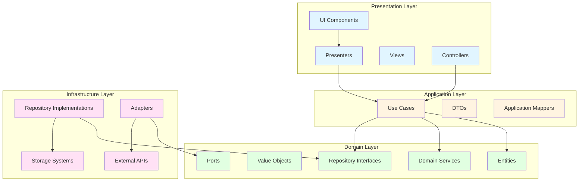
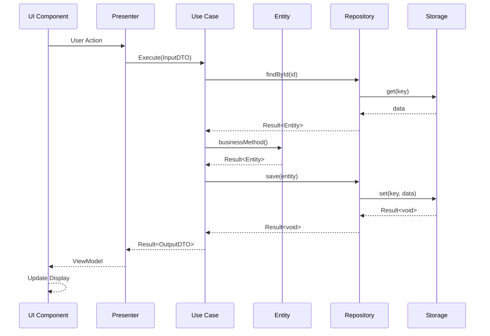
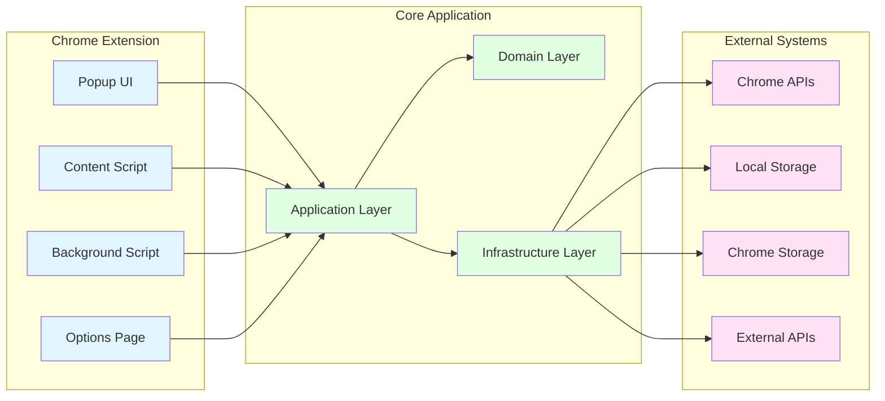
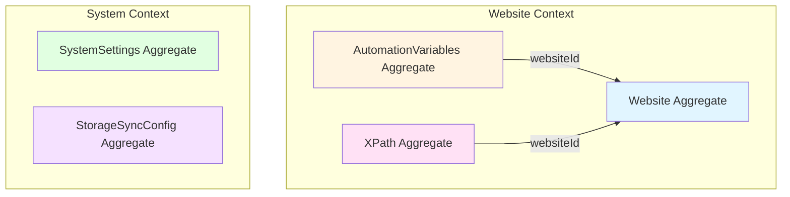
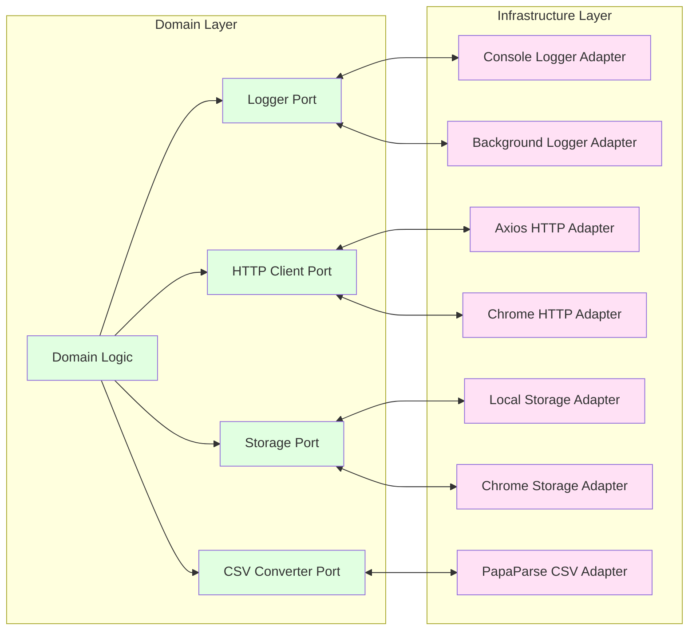
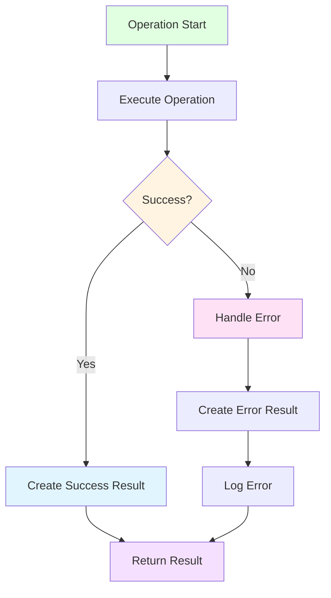
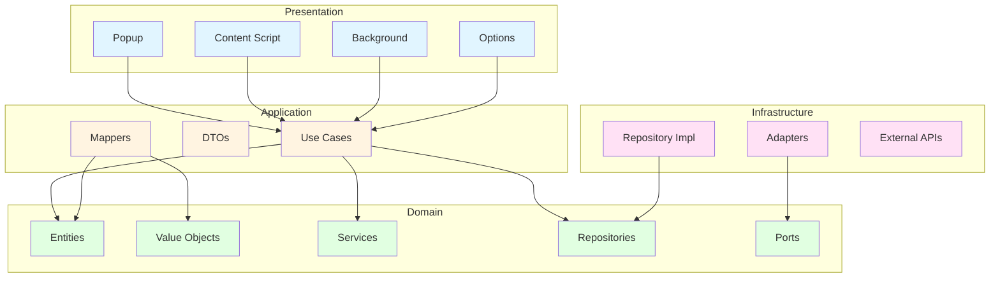
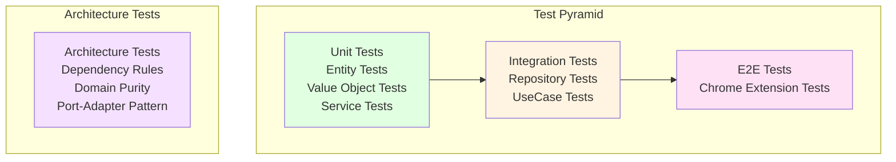

# アーキテクチャ図

## 概要

本ドキュメントは、Auto-Fill Toolのアーキテクチャを視覚的に表現した図を提供します。

---

## 1. レイヤー構造図

---

## 2. データフロー図

---

## 3. コンポーネント図

---

## 4. Aggregate関係図

---

## 5. Port-Adapter パターン図

---

## 6. エラーハンドリングフロー図

---

## 7. 依存関係図

---

## 8. テストピラミッド図

---

## 図の説明

### レイヤー構造図

- Clean Architectureの4層構造を表現
- 依存関係の方向（内向き）を明示
- 各層の主要コンポーネントを表示

### データフロー図

- ユーザーアクションから結果表示までの流れ
- 各層での処理とデータ変換を表現
- Result パターンの使用を明示

### コンポーネント図

- Chrome Extension の構成要素
- 外部システムとの関係
- 主要なアーキテクチャレイヤー

### Aggregate関係図

- ドメインモデルのAggregate境界
- Aggregate間の参照関係
- コンテキスト境界

### Port-Adapter パターン図

- ドメインと外部システムの分離
- 複数の実装（Adapter）の切り替え可能性
- インターフェース（Port）による抽象化

---

最終更新日: 2024年11月22日
