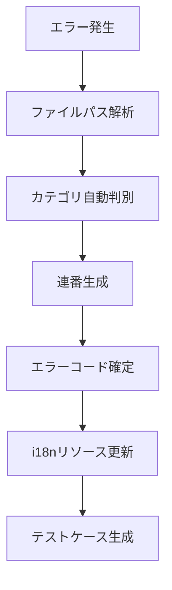

# エラーハンドリング標準化・テストコード管理機能 - 外部仕様

**作成日**: 2025-11-01  
**バージョン**: 1.0  
**ステータス**: 設計中

---

## 📋 機能仕様

### 1. エラーコード自動判別システム

**概要**: ファイルパスとエラー内容から自動的にエラーコードを生成・割り当て

**エラーコード形式**: `E-{CATEGORY}-{NUMBER}`

**カテゴリ分類**:
- `XPATH`: XPath関連エラー (E-XPATH-0001)
- `AUTH`: 認証関連エラー (E-AUTH-0001)
- `SYNC`: 同期関連エラー (E-SYNC-0001)
- `STORAGE`: ストレージ関連エラー (E-STORAGE-0001)
- `VALIDATION`: バリデーション関連エラー (E-VALIDATION-0001)
- `NETWORK`: ネットワーク関連エラー (E-NETWORK-0001)
- `CRYPTO`: 暗号化関連エラー (E-CRYPTO-0001)
- `I18N`: 国際化関連エラー (E-I18N-0001)
- `PERFORMANCE`: パフォーマンス関連エラー (E-PERFORMANCE-0001)
- `SYSTEM`: システム関連エラー (E-SYSTEM-0001)

### 2. エラーコード管理機能

**自動生成**:
- ファイルパス解析による自動カテゴリ判別
- 連番自動割り当て（カテゴリ別）
- 重複チェック機能

**一元管理**:
- エラーコード定義ファイル (`ErrorCodes.ts`)
- i18nリソースとの自動同期
- エラーコード一覧の自動生成

### 3. テストコード管理機能

**テストケース自動生成**:
- エラーコードに対応するテストケースの自動生成
- 正常系・異常系テストの雛形作成
- モックデータの自動生成

**テスト実行管理**:
- エラーコード別テスト実行
- カバレッジレポートのエラーコード別集計
- 未テストエラーコードの検出

---

## 📋 非機能仕様

### 1. パフォーマンス要件

- **エラーコード生成**: 10ms以内
- **エラーコード検索**: 5ms以内
- **i18nリソース同期**: 100ms以内
- **メモリ使用量**: 追加5MB以内

### 2. 保守性要件

- **エラーコード追加**: 開発者が手動追加不要
- **i18n更新**: エラーコード追加時に自動更新
- **テスト生成**: 1コマンドで完了
- **ドキュメント**: エラーコード一覧の自動生成

### 3. 互換性要件

- **既存エラー**: 後方互換性を保持
- **i18n**: 既存の翻訳キーとの共存
- **テスト**: 既存テストとの統合
- **ビルド**: 既存ビルドプロセスとの統合

### 4. セキュリティ要件

- **エラー情報**: 機密情報の漏洩防止
- **ログ出力**: セキュリティイベントの適切な記録
- **デバッグ情報**: 本番環境での情報制限

---

## 🎯 ユーザー体験

### 1. 開発者体験

**エラー発生時**:
```typescript
// Before
throw new Error('XPath not found');

// After  
throw new StandardError('E-XPATH-0001', { xpath: '//*[@id="test"]' });
```

**ログ出力**:
```
[E-XPATH-0001] XPath要素が見つかりません: //*[@id="test"]
```

### 2. エンドユーザー体験

**エラー表示**:
- 技術的詳細を隠蔽
- ユーザーフレンドリーなメッセージ
- 多言語対応（自動翻訳）
- 解決方法の提示

**例**:
```
❌ XPath要素が見つかりません
💡 ページの構造が変更された可能性があります。XPath設定を確認してください。
🔧 エラーコード: E-XPATH-0001
```

---

## 🔄 ワークフロー

### 1. エラーコード生成フロー



### 2. 開発フロー

1. **開発者**: 通常通りエラーを実装
2. **システム**: エラーコードを自動生成・割り当て
3. **システム**: i18nリソースを自動更新
4. **システム**: テストケースを自動生成
5. **開発者**: 必要に応じてメッセージをカスタマイズ

---

## 📈 期待効果

### 1. 開発効率向上

- **エラーコード管理**: 手動作業を90%削減
- **i18n更新**: 自動化により100%削減
- **テスト作成**: 雛形生成により50%削減
- **デバッグ時間**: エラー特定時間を70%削減

### 2. 品質向上

- **エラー追跡**: 全エラーの一意識別
- **テストカバレッジ**: エラーケースの網羅
- **多言語対応**: 全エラーメッセージの翻訳
- **保守性**: 統一されたエラー管理

### 3. ユーザー体験向上

- **分かりやすいエラー**: 技術的詳細の隠蔽
- **多言語サポート**: ユーザーの言語での表示
- **解決方法提示**: エラーからの回復支援
- **一貫性**: 統一されたエラー表示
