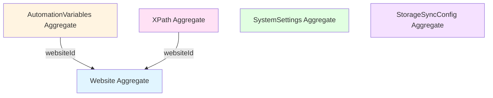

# ドメインモデル

## 概要

本ドキュメントは、Auto-Fill Toolのドメインモデルを定義します。DDDの観点から、Aggregate、Entity、Value Objectの関係を明確にします。

---

## Aggregateの定義

### 1. Website Aggregate

#### Aggregate Root

**Website** - Webサイトの設定を表すエンティティ

#### 構成要素

- **Website** (Entity)
  - WebsiteId (Value Object)
  - WebsiteUrl (Value Object)
  - name (string)
  - updatedAt (Date)
  - editable (boolean)

#### 境界

- WebsiteIdによって識別される
- 他のAggregateから参照される際は、WebsiteIdを使用

#### ビジネスルール

- Websiteは一意のIDを持つ
- 名前は必須
- URLはオプションだが、指定する場合は有効なURLである必要がある
- editableフラグにより、編集可能性を制御

#### トランザクション境界

- Website単体で保存・取得される
- WebsiteCollectionは複数のWebsiteを管理するが、個々のWebsiteは独立したAggregate

---

### 2. AutomationVariables Aggregate

#### Aggregate Root

**AutomationVariables** - 特定のWebサイトに対する自動化変数と状態を表すエンティティ

#### 構成要素

- **AutomationVariables** (Entity)
  - id (string)
  - websiteId (string) - 外部参照
  - variables (Record<string, string>)
  - status (AutomationStatus)
  - updatedAt (Date)

#### 境界

- idによって識別される
- websiteIdを通じてWebsite Aggregateを参照

#### ビジネスルール

- AutomationVariablesは特定のWebsiteに紐づく
- statusが'once'の場合、実行後自動的に'disabled'になる
- 変数の追加・削除・更新は不変操作（新しいインスタンスを返す）

#### トランザクション境界

- AutomationVariables単体で保存・取得される
- Websiteとは独立して管理される（別のストレージキー）

---

### 3. XPath Aggregate

#### Aggregate Root

**XPathCollection** - 特定のWebサイトに対するXPath設定のコレクション

#### 構成要素

- **XPathCollection** (Entity)
  - xpaths (Map<string, XPathData>)
- **XPathData** (Value Object的なデータ構造)
  - id (string)
  - websiteId (string) - 外部参照
  - value (string)
  - actionType (ActionType)
  - pathAbsolute, pathShort, pathSmart (string)
  - selectedPathPattern (PathPattern)
  - executionOrder (number)
  - その他の設定

#### 境界

- WebsiteIdによってグループ化される
- 個々のXPathはidで識別されるが、XPathCollectionを通じて管理される

#### ビジネスルール

- XPathは特定のWebsiteに紐づく
- executionOrderによって実行順序が決定される
- 同じWebsite内のXPathは、executionOrderが重複しないように管理される
- XPathの追加・更新・削除は不変操作

#### トランザクション境界

- XPathCollection全体で保存・取得される
- Websiteとは独立して管理される

---

### 4. SystemSettings Aggregate

#### Aggregate Root

**SystemSettingsCollection** - システム全体の設定を表すエンティティ

#### 構成要素

- **SystemSettingsCollection** (Entity)
  - retryWaitSecondsMin, retryWaitSecondsMax (number)
  - retryCount (number)
  - recordingSettings (各種設定)
  - logSettings (各種設定)
  - その他のシステム設定

#### 境界

- システム全体で単一のインスタンス
- 他のAggregateから参照されない

#### ビジネスルール

- システム全体で共有される設定
- デフォルト値が定義されている
- リセット機能により、デフォルト値に戻すことができる

#### トランザクション境界

- SystemSettingsCollection全体で保存・取得される

---

### 5. StorageSyncConfig Aggregate

#### Aggregate Root

**StorageSyncConfig** - ストレージ同期の設定を表すエンティティ

#### 構成要素

- **StorageSyncConfig** (Entity)
  - id (string)
  - storageKey (string)
  - syncMethod (string)
  - syncTiming (SyncTiming)
  - syncDirection (SyncDirection)
  - enabled (boolean)
  - その他の同期設定
- **RetryPolicy** (Value Object)
  - maxRetries (number)
  - retryDelay (number)
  - backoffMultiplier (number)

#### 境界

- idによって識別される
- 複数のStorageSyncConfigが存在可能

#### ビジネスルール

- 各ストレージキーに対して同期設定を持つ
- 同期方向（送信のみ、受信のみ、双方向）を指定
- リトライポリシーを持つ

#### トランザクション境界

- StorageSyncConfig単体で保存・取得される

---

## Aggregate間の関係

### 参照ルール

1. **AutomationVariables → Website**: websiteIdによる参照
2. **XPath → Website**: websiteIdによる参照
3. **他のAggregateは独立**: 相互参照なし

### 整合性の保証

- **Aggregate内**: 強い整合性（トランザクション境界内）
- **Aggregate間**: 結果整合性（イベントまたはアプリケーションサービスで調整）

---

## Entity vs Value Object

### Entity

- **Website**: WebsiteIdによって識別される
- **AutomationVariables**: idによって識別される
- **XPathCollection**: コレクション全体がEntity
- **SystemSettingsCollection**: システム全体で単一のEntity
- **StorageSyncConfig**: idによって識別される

### Value Object

- **WebsiteId**: Websiteの識別子
- **WebsiteUrl**: URL値
- **XPathData**: XPath設定のデータ構造（不変）
- **RetryPolicy**: リトライ設定
- **AutomationStatus**: 自動化の状態（Enum）
- **ActionType, PathPattern, RetryType**: 各種定数

---

## Repository パターン

### Repository と Aggregate の対応

| Repository                    | Aggregate Root           | 説明                                  |
| ----------------------------- | ------------------------ | ------------------------------------- |
| WebsiteRepository             | Website                  | Website Aggregateの永続化             |
| AutomationVariablesRepository | AutomationVariables      | AutomationVariables Aggregateの永続化 |
| XPathRepository               | XPathCollection          | XPath Aggregateの永続化               |
| SystemSettingsRepository      | SystemSettingsCollection | SystemSettings Aggregateの永続化      |
| StorageSyncConfigRepository   | StorageSyncConfig        | StorageSyncConfig Aggregateの永続化   |

### Repository の責務

- Aggregate Root単位での保存・取得
- Aggregate境界を越えた操作は行わない
- トランザクション境界を尊重

---

## ドメインイベント

### 主要なドメインイベント

#### Website関連

- `WebsiteCreated`: Websiteが作成された
- `WebsiteUpdated`: Websiteが更新された
- `WebsiteDeleted`: Websiteが削除された

#### AutomationVariables関連

- `AutomationVariablesCreated`: AutomationVariablesが作成された
- `AutomationVariablesUpdated`: AutomationVariablesが更新された
- `AutomationStatusChanged`: 自動化状態が変更された
- `AutomationExecutionCompleted`: 自動化実行が完了した

#### XPath関連

- `XPathAdded`: XPathが追加された
- `XPathUpdated`: XPathが更新された
- `XPathDeleted`: XPathが削除された

### イベントの使用

- Aggregate間の結果整合性の実現
- 監査ログの記録
- 通知の送信

---

## ビジネスルールの配置

### Aggregate Root内

- **Website**: URL検証、名前検証
- **AutomationVariables**: status遷移ルール（once → disabled）
- **XPathCollection**: executionOrderの管理

### Domain Service

- **URLMatchingService**: URLマッチングロジック
- **XPathSelectionService**: XPath選択ロジック
- **VariableSubstitutionService**: 変数置換ロジック

### Application Service (UseCase)

- Aggregate間の調整
- トランザクション管理
- イベント発行

---

## 設計上の決定事項

### 1. WebsiteとAutomationVariablesの分離

**理由**:

- ストレージの分離（localStorage vs chrome.storage）
- 更新頻度の違い
- トランザクション境界の明確化

**トレードオフ**:

- ✅ 柔軟性が高い
- ✅ パフォーマンスが良い
- ❌ 整合性の管理が複雑

### 2. XPathCollectionをAggregate Rootに

**理由**:

- XPathは常にコレクションとして扱われる
- executionOrderの管理が必要
- トランザクション境界が明確

**トレードオフ**:

- ✅ 整合性が保たれる
- ✅ ビジネスルールが集約される
- ❌ 大量のXPathがある場合、パフォーマンスに影響

### 3. SystemSettingsを単一のAggregate に

**理由**:

- システム全体で共有される設定
- 部分的な更新が必要
- デフォルト値の管理

**トレードオフ**:

- ✅ 管理が簡単
- ✅ 整合性が保たれる
- ❌ 設定が増えると肥大化

---

## 今後の改善案

### 1. Aggregate境界の見直し

- WebsiteとAutomationVariablesを統合するか検討
- XPathCollectionのサイズ制限を検討

### 2. ドメインイベントの活用

- イベントソーシングの導入を検討
- 監査ログの充実

### 3. Value Objectの追加

- ExecutionOrder (Value Object)
- VariableName (Value Object)
- XPathExpression (Value Object) - 既に存在

---

## 参考資料

### 書籍

- Domain-Driven Design (Eric Evans)
- Implementing Domain-Driven Design (Vaughn Vernon)

### 既存のコード

- `src/domain/entities/`
- `src/domain/values/`
- `src/domain/repositories/`

---

最終更新日: 2024年11月22日
