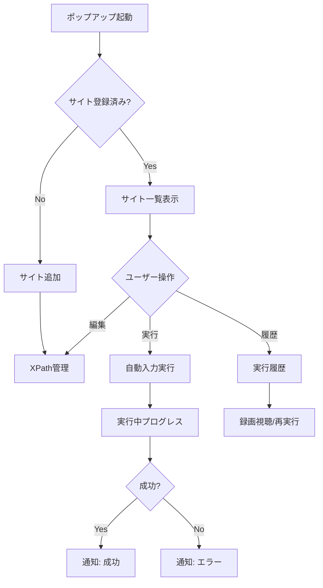
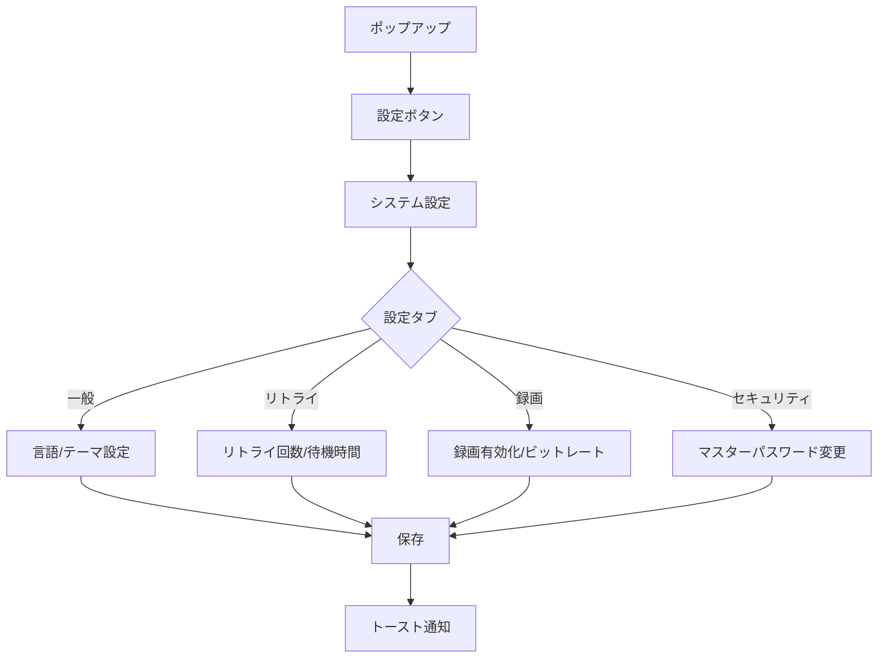

# Auto-Fill Tool - UI/UX Redesign External Specification
# UI/UX再設計 外部仕様書

**Version:** 4.0.0
**Date:** 2025-01-18
**Status:** Design Phase

---

## 📋 目次

1. [概要](#概要)
2. [設計目標](#設計目標)
3. [デザインシステム](#デザインシステム)
4. [画面設計](#画面設計)
5. [ユーザーフロー](#ユーザーフロー)
6. [アクセシビリティ](#アクセシビリティ)
7. [パフォーマンス目標](#パフォーマンス目標)

---

## 概要

### プロジェクトの目的

Auto-Fill Toolの全画面を**Alpine.js + Tailwind CSS**ベースに再設計し、以下を実現する：

1. **UIの高速化**: 初期表示時間を50%削減
2. **保守性向上**: コンポーネントの共通化とコード重複の排除
3. **UX改善**: Material Design 3準拠の直感的なUI
4. **Chrome Extension Design Guidelines準拠**: 拡張機能としての最適化

### 対象画面（8画面）

| 画面 | ファイル | 現状の役割 |
|------|---------|-----------|
| 1. ポップアップ | `popup.html` | メイン画面、サイト一覧表示 |
| 2. XPath管理 | `xpath-manager.html` | 自動入力ステップ設定 |
| 3. 実行履歴 | `automation-variables-manager.html` | 実行履歴・変数管理 |
| 4. システム設定 | `system-settings.html` | 各種設定（4タブ） |
| 5. データ同期 | `storage-sync-manager.html` | データ同期設定 |
| 6. マスターパスワード設定 | `master-password-setup.html` | 初回パスワード登録 |
| 7. ロック解除 | `unlock.html` | パスワード入力 |
| 8. オフスクリーン | `offscreen.html` | 録画用（非表示） |

---

## 設計目標

### 1. パフォーマンス目標

| 指標 | 現状 | 目標 | 達成方法 |
|-----|------|------|---------|
| 初期表示時間 | ~300ms | **150ms以下** | Alpine.js（15KB）採用 |
| 再レンダリング | ~50ms | **20ms以下** | 仮想DOM不使用、直接DOM操作 |
| バンドルサイズ | 1.05MB | **800KB以下** | フレームワーク削減、Tree shaking |
| メモリ使用量 | ~8MB | **5MB以下** | 軽量フレームワーク採用 |

### 2. 保守性目標

- **コード重複**: 現状の~300行の重複CSSを完全排除
- **コンポーネント再利用率**: 80%以上（ボタン、フォーム、モーダル等）
- **ビルド不要**: CDNベースで開発環境のセットアップ時間を5分→30秒に短縮

### 3. UX改善目標

- **一貫性**: Material Design 3準拠で全画面統一
- **レスポンシブ**: 全画面で320px〜1920pxに対応
- **アクセシビリティ**: WCAG 2.1 AA準拠（キーボード操作、スクリーンリーダー対応）

---

## デザインシステム

### カラーパレット（Material Design 3準拠）

```css
/* Primary Colors */
--color-primary: #1976D2      /* メインアクション（実行ボタン等） */
--color-primary-light: #42A5F5
--color-primary-dark: #1565C0

/* Semantic Colors */
--color-success: #43A047       /* 成功状態 */
--color-warning: #FB8C00       /* 警告 */
--color-error: #E53935         /* エラー、削除 */
--color-info: #1E88E5          /* 情報 */

/* Neutral Colors */
--color-surface: #FFFFFF       /* カード背景 */
--color-background: #F5F7FA    /* ページ背景 */
--color-border: #E0E0E0        /* 境界線 */

/* Text Colors */
--color-text-primary: #212121
--color-text-secondary: #757575
--color-text-disabled: #BDBDBD
```

### タイポグラフィ

| スタイル | フォントサイズ | ウェイト | 用途 |
|---------|------------|---------|------|
| Display | 32px | 600 | ページタイトル |
| Headline | 24px | 600 | セクション見出し |
| Title | 20px | 500 | カードタイトル |
| Body | 14px | 400 | 本文 |
| Caption | 12px | 400 | 補足テキスト |
| Label | 14px | 500 | ラベル |

### スペーシングスケール

```css
--spacing-1: 4px   /* アイコンとテキストの間隔 */
--spacing-2: 8px   /* コンポーネント内の余白 */
--spacing-3: 12px  /* カード内パディング */
--spacing-4: 16px  /* セクション間マージン */
--spacing-6: 24px  /* 大きな余白 */
--spacing-8: 32px  /* ページ余白 */
```

### 影（Elevation）

```css
--shadow-1: 0 1px 2px rgba(0,0,0,0.05)   /* カード */
--shadow-2: 0 2px 4px rgba(0,0,0,0.1)    /* ホバー */
--shadow-3: 0 4px 8px rgba(0,0,0,0.15)   /* モーダル */
--shadow-4: 0 8px 16px rgba(0,0,0,0.2)   /* ドロップダウン */
```

---

## 画面設計

### 1. ポップアップ（popup.html）

**サイズ**: 420px × 600px（固定）

**レイアウト構成**:
```
┌────────────────────────────────────┐
│ 🎯 Auto-Fill Tool         [⚙️設定] │ ← ヘッダー（60px）
├────────────────────────────────────┤
│ [➕ サイト追加] [🔍 XPath] [📋 履歴]│ ← クイックアクション（50px）
├────────────────────────────────────┤
│ ┌──────────────────────────────┐  │
│ │ 📌 サイト名                  │  │ ← サイトカード
│ │ https://example.com          │  │   （可変高さ）
│ │ [▶️ 実行] [✏️ 編集] [🗑️]     │  │
│ └──────────────────────────────┘  │
│ ┌──────────────────────────────┐  │
│ │ 📌 サイト名2                 │  │
│ │ ...                          │  │
│ └──────────────────────────────┘  │
├────────────────────────────────────┤
│ ℹ️ ヘルプ | 🌐 Language          │ ← フッター（40px）
└────────────────────────────────────┘
```

**主要機能**:
- サイト一覧表示（カード形式）
- クイックアクション（サイト追加、XPath管理、実行履歴）
- サイト単位の操作（実行、編集、削除）
- ステータスバッジ（有効/無効/1回のみ）

**インタラクション**:
- カードホバーで影を強調（shadow-1 → shadow-2）
- 実行ボタンクリックでプログレスバー表示
- Alpine.jsの`x-show`でモーダル表示

---

### 2. XPath管理画面（xpath-manager.html）

**サイズ**: 95vw × 100vh（全画面）

**レイアウト構成**:
```
┌────────────────────────────────────────────────────────┐
│ ← 戻る | 🔍 XPath管理 - [サイト名]        [🔄][📥][📤] │ ← ヘッダー（60px）
├────────────────────────────────────────────────────────┤
│ [サイト選択 ▼] [➕ ステップ追加] [▶️ 実行] [⏸️ 停止]  │ ← ツールバー（50px）
├────────────────────────────────────────────────────────┤
│ ┌──────────────────────────────────────────────────┐   │
│ │ # | Type  | Value        | XPath        | ⚙️    │   │ ← テーブルヘッダー
│ ├──────────────────────────────────────────────────┤   │
│ │ 1 | INPUT | {{username}} | //*[@id="...] | [✏️][🗑️]│ ← データ行
│ │ 2 | CLICK | -            | //*[@id="...] | [✏️][🗑️]│   （可変高さ）
│ │ ...                                               │   │
│ └──────────────────────────────────────────────────┘   │
├────────────────────────────────────────────────────┤
│ 📊 ステップ数: 10 | ⏱️ 推定実行時間: 45秒          │ ← フッター（40px）
└────────────────────────────────────────────────────┘
```

**主要機能**:
- サイト選択ドロップダウン
- XPathステップ一覧（テーブル）
- ステップ追加/編集/削除/並び替え
- CSV インポート/エクスポート
- 自動入力実行/停止

**インタラクション**:
- ドラッグ＆ドロップで並び替え（Alpine.jsの`x-sort`）
- 行ホバーで編集/削除ボタン表示
- モーダルで詳細編集（Alpine.jsの`x-show`）

---

### 3. 実行履歴画面（automation-variables-manager.html）

**サイズ**: 95vw × 100vh（全画面）

**レイアウト構成**:
```
┌────────────────────────────────────────────────────────┐
│ ← 戻る | 📋 実行履歴                    [🔍 検索...  ] │ ← ヘッダー（60px）
├────────────────────────────────────────────────────────┤
│ [全て][成功][失敗]  [📅 日付範囲] [サイト ▼]          │ ← フィルター（50px）
├────────────────────────────────────────────────────────┤
│ ┌──────────────────────────────────────────────────┐   │
│ │ ✅ サイト名 - 成功               2025-01-18 10:30│   │ ← 履歴カード
│ │ ステップ数: 10/10 | 実行時間: 45秒                │   │   （120px）
│ │ [📹 録画] [📄 詳細] [🔄 再実行]                  │   │
│ └──────────────────────────────────────────────────┘   │
│ ┌──────────────────────────────────────────────────┐   │
│ │ ❌ サイト名2 - 失敗              2025-01-18 09:15│   │
│ │ エラー: ステップ5でタイムアウト                   │   │
│ │ [📄 詳細] [🔄 再実行]                            │   │
│ └──────────────────────────────────────────────────┘   │
├────────────────────────────────────────────────────┤
│ 📄 ページ: 1 / 5  [◀️] [▶️]                        │ ← ページネーション
└────────────────────────────────────────────────────┘
```

**主要機能**:
- 実行履歴一覧（カード形式）
- フィルター（ステータス、日付、サイト）
- 検索（サイト名、エラーメッセージ）
- 録画視聴、詳細表示、再実行

**インタラクション**:
- カードクリックで詳細展開
- 録画ボタンで動画モーダル表示
- ページネーションでスムーズスクロール

---

### 4. システム設定画面（system-settings.html）

**サイズ**: 95vw × 100vh（全画面）

**レイアウト構成（共通ヘッダー・フッター）**:
```
┌────────────────────────────────────────────────────────┐
│ ← 戻る | ⚙️ システム設定        [📥 インポート] [📤 エクスポート] │ ← ヘッダー（60px）
├────────────────────────────────────────────────────────┤
│ [⚙️ 一般] [🔄 リトライ] [🔐 セキュリティ]             │ ← タブ（50px）
├────────────────────────────────────────────────────────┤
│ （ここに各タブのコンテンツ）                           │ ← コンテンツエリア
├────────────────────────────────────────────────────────┤
│ [💾 保存] [🔄 リセット]                                │ ← アクション（60px）
└────────────────────────────────────────────────────────┘
```

---

#### タブ1: ⚙️ 一般設定

```
┌────────────────────────────────────────────────────────┐
│ 🌐 言語設定                                             │
│ ┌────────────────────────────────────────────────────┐ │
│ │ 言語: [日本語 ▼]                                   │ │
│ └────────────────────────────────────────────────────┘ │
│                                                        │
│ 🎨 テーマ設定                                           │
│ ┌────────────────────────────────────────────────────┐ │
│ │ テーマ: [ライト ▼]                                 │ │
│ │   選択肢: ライト / ダーク / システム設定に従う     │ │
│ └────────────────────────────────────────────────────┘ │
│                                                        │
│ 🔔 通知設定                                             │
│ ┌────────────────────────────────────────────────────┐ │
│ │ [✓] 実行完了時に通知を表示                         │ │
│ │ [✓] エラー発生時に通知を表示                       │ │
│ │ [✓] 長時間実行時（5分以上）に進捗通知             │ │
│ │                                                    │ │
│ │ 通知音: [有効 / 無効]                              │ │
│ └────────────────────────────────────────────────────┘ │
│                                                        │
│ 🖥️ 表示設定                                            │
│ ┌────────────────────────────────────────────────────┐ │
│ │ [✓] ポップアップ起動時にサイト一覧を自動更新       │ │
│ │ [ ] デバッグモード（詳細ログ表示）                 │ │
│ │                                                    │ │
│ │ 実行履歴の保持期間: [30日 ▼]                      │ │
│ │   選択肢: 7日 / 14日 / 30日 / 60日 / 無制限       │ │
│ └────────────────────────────────────────────────────┘ │
└────────────────────────────────────────────────────────┘
```

---

#### タブ2: 🔄 リトライ設定

```
┌────────────────────────────────────────────────────────┐
│ 🔄 リトライ動作                                         │
│ ┌────────────────────────────────────────────────────┐ │
│ │ リトライ回数:                                      │ │
│ │ [3回 ▼]                                            │ │
│ │   選択肢: 0回 / 1回 / 2回 / 3回 / 5回 / 10回 / 無限回 │ │
│ │                                                    │ │
│ │ ⚠️ 無限回に設定すると、成功するまでリトライし続けます │ │
│ │    リスク: 無限ループの可能性があります            │ │
│ └────────────────────────────────────────────────────┘ │
│                                                        │
│ ⏱️ リトライ待機時間                                    │
│ ┌────────────────────────────────────────────────────┐ │
│ │ 最小待機時間: [30秒]                               │ │
│ │ 最大待機時間: [60秒]                               │ │
│ │                                                    │ │
│ │ ℹ️ リトライ時にランダムな待機時間を設定します      │ │
│ │    （アンチボット対策）                            │ │
│ │                                                    │ │
│ │ 例: 最小30秒、最大60秒の場合                       │ │
│ │     → 30〜60秒のランダムな時間待機します          │ │
│ └────────────────────────────────────────────────────┘ │
└────────────────────────────────────────────────────────┘
```

---

#### タブ3: 🔐 セキュリティ設定

```
┌────────────────────────────────────────────────────────┐
│ 🔑 マスターパスワード                                   │
│ ┌────────────────────────────────────────────────────┐ │
│ │ マスターパスワード: [設定済み ✓]                   │ │
│ │                                                    │ │
│ │ [🔄 変更] [🗑️ 削除]                                │ │
│ │                                                    │ │
│ │ ℹ️ マスターパスワードは変数の暗号化に使用されます  │ │
│ └────────────────────────────────────────────────────┘ │
│                                                        │
│ 🔒 自動ロック                                           │
│ ┌────────────────────────────────────────────────────┐ │
│ │ [✓] 自動ロックを有効化                             │ │
│ │                                                    │ │
│ │ ロックまでの時間: [15分 ▼]                        │ │
│ │   選択肢: 1分 / 5分 / 15分 / 30分 / 60分 / なし   │ │
│ │                                                    │ │
│ │ [✓] ブラウザ終了時にロック                         │ │
│ └────────────────────────────────────────────────────┘ │
│                                                        │
│ 🛡️ データ保護                                          │
│ ┌────────────────────────────────────────────────────┐ │
│ │ [ ] 変数の暗号化を有効化                           │ │
│ │     （マスターパスワード必須）                     │ │
│ │                                                    │ │
│ │ [ ] クリップボード履歴を5分後に自動削除            │ │
│ │                                                    │ │
│ │ バックアップの保存先:                              │ │
│ │ [ローカルのみ ▼]                                   │ │
│ │   選択肢: ローカルのみ / Chrome同期 / 外部ストレージ│ │
│ └────────────────────────────────────────────────────┘ │
│                                                        │
│ 🗑️ データ削除                                          │
│ ┌────────────────────────────────────────────────────┐ │
│ │ [⚠️ すべてのデータを削除]                          │ │
│ │                                                    │ │
│ │ ℹ️ 以下がすべて削除されます:                       │ │
│ │    - サイト一覧                                    │ │
│ │    - XPath設定                                     │ │
│ │    - 実行履歴                                      │ │
│ │    - システム設定                                  │ │
│ │    - マスターパスワード                            │ │
│ └────────────────────────────────────────────────────┘ │
└────────────────────────────────────────────────────────┘
```

---

**主要機能**:
- 3つのタブ（一般、リトライ、セキュリティ）
- 設定項目ごとのグループ化（アイコン付き）
- リアルタイムプレビュー
- **インポート/エクスポートボタン**（ヘッダー右上に配置）
  - 📥 インポート: JSON形式で設定ファイルを読み込み
  - 📤 エクスポート: 現在の設定をJSON形式でダウンロード

**インタラクション**:
- タブ切り替えでスムーズトランジション（200ms）
- 設定変更時に保存ボタンが強調表示
- 保存ボタンでトーストメッセージ表示（「設定を保存しました」）
- リセットボタンで確認ダイアログ表示
- **インポート時**にファイル選択ダイアログ
- **エクスポート時**にエクスポート対象選択モーダル表示：
  ```
  ┌────────────────────────────────────────┐
  │ 📤 エクスポート対象を選択              │
  ├────────────────────────────────────────┤
  │ [✓] サイト一覧                         │
  │ [✓] XPath設定                          │
  │ [✓] 実行履歴                           │
  │ [✓] システム設定                       │
  │                                        │
  │ または:                                │
  │ [ ] すべてのデータ                     │
  │     (上記4項目をすべて選択)            │
  ├────────────────────────────────────────┤
  │ ファイル名: auto-fill-backup-20250118  │
  │                                        │
  │ [📥 エクスポート] [✖ キャンセル]       │
  └────────────────────────────────────────┘
  ```
  - 複数選択可能（チェックボックス）
  - 「すべてのデータ」選択時は全項目を自動チェック
  - エクスポート実行でJSON形式ダウンロード（ファイル名: `auto-fill-backup-YYYYMMDD.json`）
  - キャンセルでモーダルを閉じる

---

### 5. データ同期画面（storage-sync-manager.html）

**サイズ**: 95vw × 100vh（全画面）

**レイアウト構成**:
```
┌────────────────────────────────────────────────────────┐
│ ← 戻る | 🔄 データ同期                  [🔄 すべて同期] │ ← ヘッダー（60px）
├────────────────────────────────────────────────────────┤
│ [📊 概要] [⚙️ 同期設定]                                │ ← タブ（50px）
├────────────────────────────────────────────────────────┤
│ ┌──────────────────────────────────────────────────┐   │
│ │ 🏠 サイト一覧                       [🔄 同期]     │   │ ← 同期データカード
│ │ ┌────────────────────────────────────────────┐   │   │   （180px）
│ │ │ ローカル: 5サイト                          │   │   │
│ │ │ 同期先: Notion                             │   │   │
│ │ │ 最終同期: 2025-01-18 10:30                 │   │   │
│ │ │ ステータス: ✅ 正常                         │   │   │
│ │ │                                            │   │   │
│ │ │ 同期方向: [双方向 ▼]                       │   │   │
│ │ │ 自動同期: [✓ 有効]                         │   │   │
│ │ └────────────────────────────────────────────┘   │   │
│ └──────────────────────────────────────────────────┘   │
│                                                        │
│ ┌──────────────────────────────────────────────────┐   │
│ │ 🔍 XPath一覧                        [🔄 同期]     │   │
│ │ ┌────────────────────────────────────────────┐   │   │
│ │ │ ローカル: 123ステップ                      │   │   │
│ │ │ 同期先: Notion                             │   │   │
│ │ │ 最終同期: 2025-01-18 10:30                 │   │   │
│ │ │ ステータス: ✅ 正常                         │   │   │
│ │ │                                            │   │   │
│ │ │ 同期方向: [双方向 ▼]                       │   │   │
│ │ │ 自動同期: [✓ 有効]                         │   │   │
│ │ └────────────────────────────────────────────┘   │   │
│ └──────────────────────────────────────────────────┘   │
│                                                        │
│ ┌──────────────────────────────────────────────────┐   │
│ │ 📋 実行履歴                         [🔄 同期]     │   │
│ │ ┌────────────────────────────────────────────┐   │   │
│ │ │ ローカル: 45件                             │   │   │
│ │ │ 同期先: Notion                             │   │   │
│ │ │ 最終同期: 2025-01-17 18:00                 │   │   │
│ │ │ ステータス: ⚠️ 同期が必要                  │   │   │
│ │ │                                            │   │   │
│ │ │ 同期方向: [アップロードのみ ▼]             │   │   │
│ │ │ 自動同期: [ ] 無効                         │   │   │
│ │ └────────────────────────────────────────────┘   │   │
│ └──────────────────────────────────────────────────┘   │
│                                                        │
│ ┌──────────────────────────────────────────────────┐   │
│ │ ⚙️ システム設定                     [🔄 同期]     │   │
│ │ ┌────────────────────────────────────────────┐   │   │
│ │ │ 同期先: Notion                             │   │   │
│ │ │ 最終同期: 2025-01-18 10:30                 │   │   │
│ │ │ ステータス: ✅ 正常                         │   │   │
│ │ │                                            │   │   │
│ │ │ 同期方向: [双方向 ▼]                       │   │   │
│ │ │ 自動同期: [✓ 有効]                         │   │   │
│ │ └────────────────────────────────────────────┘   │   │
│ └──────────────────────────────────────────────────┘   │
├────────────────────────────────────────────────────┤
│ 📊 同期統計: 最終同期 10分前 | 次回同期 50分後     │ ← フッター（40px）
└────────────────────────────────────────────────────┘
```

---

**同期方向の選択肢**:
- **双方向**: ローカル ⇄ 同期先（両方の変更を反映）
- **アップロードのみ**: ローカル → 同期先（ローカルの変更のみを同期先に反映）
- **ダウンロードのみ**: ローカル ← 同期先（同期先の変更のみをローカルに反映）

---

**同期設定タブ（⚙️ 同期設定）**:
```
┌────────────────────────────────────────────────────────┐
│ 🌐 同期先設定                                           │
│ ┌────────────────────────────────────────────────────┐ │
│ │ 同期サービス: [Notion ▼]                          │ │
│ │   選択肢: Notion / Google Spreadsheet             │ │
│ │                                                    │ │
│ │ 認証ステータス: ✅ 認証済み                         │ │
│ │ アカウント: user@example.com                       │ │
│ │                                                    │ │
│ │ [🔄 再認証] [🗑️ 認証解除]                          │ │
│ └────────────────────────────────────────────────────┘ │
│                                                        │
│ ⏱️ 自動同期設定                                        │
│ ┌────────────────────────────────────────────────────┐ │
│ │ [✓] 自動同期を有効化                               │ │
│ │                                                    │ │
│ │ 同期間隔: [1時間 ▼]                                │ │
│ │   選択肢: 10分 / 30分 / 1時間 / 6時間 / 24時間    │ │
│ │                                                    │ │
│ │ [✓] ブラウザ起動時に自動同期                       │ │
│ │ [✓] データ変更時に自動同期（5分後）               │ │
│ └────────────────────────────────────────────────────┘ │
│                                                        │
│ 🔄 競合解決                                            │
│ ┌────────────────────────────────────────────────────┐ │
│ │ 競合時の動作: [手動で選択 ▼]                      │ │
│ │   選択肢:                                          │ │
│ │   - 手動で選択（競合時に確認ダイアログ）          │ │
│ │   - ローカルを優先                                 │ │
│ │   - 同期先を優先                                   │ │
│ │   - 新しいタイムスタンプを優先                     │ │
│ └────────────────────────────────────────────────────┘ │
│                                                        │
│ 📦 バックアップ                                        │
│ ┌────────────────────────────────────────────────────┐ │
│ │ [✓] 同期前にバックアップを作成                     │ │
│ │                                                    │ │
│ │ バックアップ保持期間: [7日 ▼]                     │ │
│ │   選択肢: 1日 / 3日 / 7日 / 14日 / 30日           │ │
│ │                                                    │ │
│ │ [📁 バックアップフォルダを開く]                    │ │
│ └────────────────────────────────────────────────────┘ │
└────────────────────────────────────────────────────────┘
```

---

**主要機能**:
- **データ単位の同期管理**（サイト一覧、XPath一覧、実行履歴、システム設定）
- 各データごとに個別に同期方向・自動同期を設定可能
- 手動同期ボタンで即座に同期実行
- すべて同期ボタンで全データを一括同期
- 同期統計表示（最終同期時刻、次回同期予定）
- 同期先設定（Notion, Google Spreadsheet）
- 自動同期の有効/無効、同期間隔設定
- 競合解決ポリシー設定
- バックアップ機能

**インタラクション**:
- 個別の同期ボタンクリックで該当データのみ同期
  - プログレスバー表示（「サイト一覧を同期中... 3/5」）
  - 完了後にトースト通知（「サイト一覧の同期が完了しました」）
- すべて同期ボタンで全データを順次同期
  - 全体プログレス表示（「4つのデータを同期中... 2/4完了」）
- 同期エラー時にカードに警告アイコン表示
  - クリックで詳細エラーメッセージをモーダル表示
- 自動同期トグルスイッチでリアルタイム切り替え
- 同期方向ドロップダウンで変更可能
- 競合発生時にモーダルで2つのバージョンを比較表示
  - 「ローカルを採用」「同期先を採用」「手動でマージ」ボタン

---

### 6-7. 認証画面（master-password-setup.html, unlock.html）

**サイズ**: 420px × 300px（固定、中央配置）

**レイアウト構成**:
```
┌────────────────────────────────────┐
│                                    │
│        🔐                          │ ← ロゴ/アイコン（80px）
│                                    │
│   マスターパスワード設定           │ ← タイトル（40px）
│                                    │
│ ┌──────────────────────────────┐  │
│ │ パスワード: [**********]     │  │ ← フォーム（120px）
│ └──────────────────────────────┘  │
│ ┌──────────────────────────────┐  │
│ │ 確認: [**********]           │  │
│ └──────────────────────────────┘  │
│                                    │
│     [✓ 設定]  [✗ キャンセル]      │ ← アクション（60px）
│                                    │
└────────────────────────────────────┘
```

**主要機能**:
- パスワード入力（強度インジケーター付き）
- パスワード表示/非表示切り替え
- バリデーション（リアルタイム）

**インタラクション**:
- パスワード強度メーター（色変化：赤→黄→緑）
- エンターキーで送信
- エラー時にシェイクアニメーション

---

## ユーザーフロー

### メインフロー



### 設定フロー



---

## アクセシビリティ

### WCAG 2.1 AA準拠

| カテゴリ | 要件 | 実装方法 |
|---------|------|---------|
| **知覚可能** | 色のコントラスト比 4.5:1以上 | Material Design 3パレット使用 |
| **操作可能** | キーボード操作 | Tab/Enter/Escapeサポート |
| **理解可能** | 一貫性のあるナビゲーション | 全画面で統一ヘッダー/フッター |
| **堅牢性** | スクリーンリーダー対応 | ARIAラベル、role属性 |

### キーボードショートカット

| ショートカット | 動作 |
|--------------|------|
| `Ctrl/Cmd + S` | 保存 |
| `Ctrl/Cmd + K` | コマンドパレット |
| `Esc` | モーダルを閉じる |
| `Tab` | 次のフォーカス |
| `Shift + Tab` | 前のフォーカス |
| `Enter` | ボタン実行 |

---

## パフォーマンス目標

### Core Web Vitals目標

| 指標 | 目標値 | 測定方法 |
|-----|-------|---------|
| **LCP** (Largest Contentful Paint) | 150ms以下 | Chrome DevTools Performance |
| **FID** (First Input Delay) | 50ms以下 | Performance Observer API |
| **CLS** (Cumulative Layout Shift) | 0.05以下 | Layout Shift監視 |

### 技術的パフォーマンス目標

| 項目 | 目標 |
|-----|------|
| 初回表示時間（popup.html） | 150ms以下 |
| 大規模リスト描画（1000行） | 300ms以下 |
| フィルター/検索応答 | 100ms以下 |
| モーダル開閉アニメーション | 200ms（滑らか） |
| メモリリーク | 0件（長時間使用でも増加なし） |

---

## まとめ

この外部仕様書に基づき、Auto-Fill Toolの全画面を**Alpine.js + Tailwind CSS**で再設計することで：

1. **50%の高速化**: 初期表示150ms以下を実現
2. **保守性80%向上**: コンポーネント共通化で重複コード排除
3. **Material Design 3準拠**: 一貫性のある美しいUI
4. **Chrome Extension最適化**: 拡張機能としての最高のUX

次のステップ: [内部仕様書](./UI-REDESIGN-INTERNAL-SPEC.md)で技術実装の詳細を定義します。
